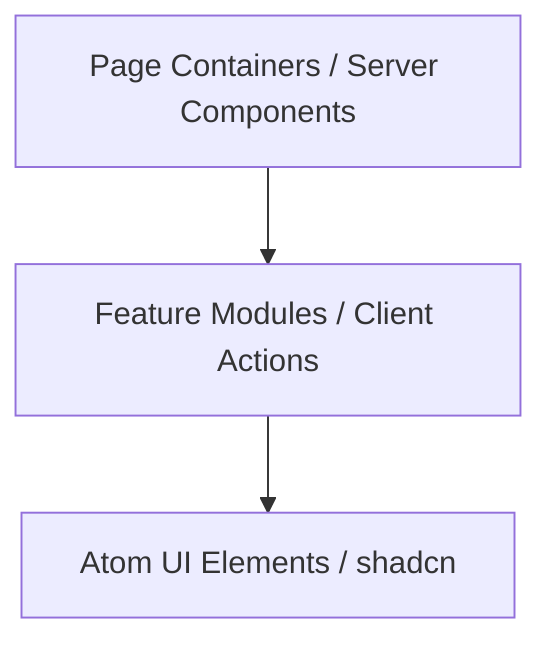

# LabCircle Monorepo Implementation Roadmap

This roadmap defines the frozen engineering blueprint, standards, and architectural guidelines for building and deploying the **LabCircle** healthcare platform. LabCircle is designed as an India-first platform, prioritizing local regulatory integrations and compliance.

---

## 1. Architecture Principles

To build a sustainable, scalable, and secure platform, all engineering decisions must align with these core principles:

*   **Customer-First:** Design every interface and workflow around the patient and clinical user's needs, prioritizing clarity, trust, and speed.
*   **Mobile-First:** Ensure all responsive designs function flawlessly on mobile web browsers first, as the majority of patient interactions in India occur on mobile devices.
*   **Firebase-First:** Leverage the Firebase suite (Firestore, Auth, Storage, Cloud Functions, and Emulators) to accelerate development and real-time syncing.
*   **Security-First:** Embed authentication, encryption, and authorization checks at every level. Never rely on client-side security assertions.
*   **Privacy by Design:** Design data schemas with data minimization, consent tracking, and data separation principles from day one, in compliance with the DPDP Act.
*   **Modular Architecture:** Structure folders and dependencies cleanly to ensure clear isolation. Code must remain modular so services can later be extracted into `apps/backend` without major refactoring.
*   **API-First:** Build functionality behind clean API boundaries (Route Handlers, Functions) to ensure compatibility with mobile apps and B2B clinic integrations.
*   **AI-Ready:** Standardize diagnostic data layouts and longitudinal profiles to simplify future machine learning and analytical integrations.
*   **Accessibility-First:** Meet WCAG 2.1 AA requirements (semantic tags, screen reader support, keyboard navigation) so users of all abilities can access diagnostic reports.
*   **Performance-First:** Target Core Web Vitals (LCP < 2.5s, FID < 100ms, CLS < 0.1) using Next.js caching, image compression, and minimal client bundle sizes.
*   **Internationalization-Ready:** Implement code with localization wrappers to support multiple local Indian languages as the user base expands.

---

## 2. Repository Structure

LabCircle uses a monorepo architecture managed by `pnpm` workspaces to cleanly isolate deployable applications from shared packages.

```text
LabCircle/
├── .github/                  # CI/CD and pull request configuration
├── apps/                     # Deployable targets
│   ├── backend/              # Central API gateway (Future placeholder only)
│   └── web/                  # Next.js 15 Client & API Portal (Primary)
├── packages/                 # Shared workspace modules
│   ├── config-eslint/        # Linter profiles and formatting rules
│   ├── config-typescript/    # Shared compiler configs (react, node, base)
│   ├── firebase/             # Shared Firebase client, Firestore queries, and rules verification
│   └── types/                # Reusable Types/Zod schemas (@labcircle/types)
├── firebase/                 # Local emulator suite, security rules, & deployment indices
├── docs/                     # Living architecture and compliance specifications
├── pnpm-workspace.yaml       # Monorepo workspace boundaries
└── package.json              # Monorepo root configuration
```

---

## 3. Shared Packages & Responsibilities

Shared modules are configured in the `packages/` directory:

| Package | Purpose & Scope | Key Technologies |
| :--- | :--- | :--- |
| `@labcircle/config-typescript` | Standardizes TS compiler targets across browser and node projects. | TypeScript, `tsconfig.json` bases |
| `@labcircle/config-eslint` | Enforces unified styling, naming conventions, and code hygiene rules. | ESLint 9 (Flat configs), Prettier |
| `@labcircle/types` | Source of truth for domain models, Zod validation schemas, and ABDM data contracts. | TypeScript, Zod |
| `@labcircle/firebase` | Firebase client initialization, Firestore typed query hooks, and storage configuration. | Firebase SDK, Firestore, Storage |

---

## 4. Firebase Architecture

*   **Firestore Security Rules:** Access is restricted using Document-Level rules based on request context:
    *   Patients can only read/write documents associated with their own `uid`.
    *   Staff (Pathologists, Technicians) must carry specific role metadata inside their Firebase Auth custom claims (e.g. `request.auth.token.role == 'pathologist'`).
*   **Storage Rules:** Secured buckets partition medical report attachments (PDFs). Reads are allowed only to matching patients and signature authorities.
*   **Local Emulators:** The local Firebase emulator (port `4000`) hosts Mock Auth, Mock Firestore, and Storage. No development connects directly to production cloud instances.

---

## 5. Coding Standards

*   **Strict Mode:** All projects enforce TypeScript strict compiler settings (`noImplicitAny: true`, `strictNullChecks: true`).
*   **Linter Enforcements:** ESLint rules check for unused variables, console leakage, and unsanitized HTML binding.
*   **Formatting Consistency:** Prettier runs automatically on save/stage, ensuring uniform spacing and automated Tailwind utility class sorting.
*   **Naming Conventions:**
    *   Component Files: PascalCase (e.g., `ReportViewer.tsx`).
    *   Hooks: camelCase starting with "use" (e.g., `usePatientRecord.ts`).
    *   Folders & Configurations: kebab-case (e.g., `config-eslint`).

---

## 6. Component Architecture

We structure Next.js component development into three strict logical layers:



1.  **Page Containers:** Server Components that manage metadata, layout boundaries, and direct server data fetching.
2.  **Feature Modules:** Interactive components (e.g., `OrderForm`, `ReportEditor`) managing local state and client actions.
3.  **Atom UI Elements:** Decoupled, stateless components managed via `shadcn/ui` (e.g., Button, Dialog, Select).

---

## 7. State Management Approach

To minimize render loops and maintain speed, state is structured as follows:
*   **Server State:** Handled directly in Next.js Server Components and revalidated using Next.js caching or router options.
*   **URL/Routing State:** Filtering, sorting parameters, and tabs are stored as query parameters (`?status=processing&page=2`) to enable bookmarking and link-sharing.
*   **Local Interactive State:** Handled via standard React `useState` / `useActionState` inside individual client components.
*   **Global Volatile State:** Light state containers (Zustand) manage temporary workspace transitions (e.g., a multi-step patient registration wizard).

---

## 8. API & Data Layer Strategy

*   **MVP Implementation Strategy:** For the MVP, business logic will primarily be implemented using Next.js Server Actions, Route Handlers, Firebase Authentication, Firestore, Storage, and Cloud Functions. The architecture must remain modular so services can later be extracted into `apps/backend` without major refactoring.
*   **Apps/Backend Isolation:** `apps/backend` is maintained purely as a future placeholder and will not be scaffolded until concrete performance constraints or microservices integration requirements (such as specialized background processing queues) justify it.
*   **Zod Data Sanitization:** All payloads are validated using schemas imported from `@labcircle/types` before writing to Firestore or executing operations.
*   **Auditing:** A global database transaction wrapper captures who requested, viewed, or modified any PHI (Protected Health Information) data.

---

## 9. Security & Compliance

LabCircle prioritizes Indian regulatory compliance as a core design parameter:

### 9.1 India-First Compliance Integration
*   **DPDP Act (Digital Personal Data Protection Act):**
    *   Explicit bilingual consent captures for data gathering.
    *   Direct dashboards enabling patients to view, edit, and revoke processing consent.
    *   Erasure protocols to purge personal data once its diagnostic context is fulfilled.
*   **ABDM (Ayushman Bharat Digital Mission) & ABHA (Health Account ID):**
    *   Verification workflows for patient ABHA addresses.
    *   Integration interfaces mapped to retrieve and submit records via ABDM health information exchange networks.
*   **NABL (National Accreditation Board for Testing & Calibration Laboratories):**
    *   Report templates structured to comply with NABL guidelines (including reference ranges, signature requirements, and instrument details).

### 9.2 Data Security & Access Controls
*   **RBAC (Role-Based Access Control):** Custom claims on Firebase user accounts enforce discrete access roles:
    *   `patient`: Read own reports, book tests.
    *   `phlebotomist`: Read assigned collections, update sample statuses.
    *   `lab_technician`: Record results, update catalogs.
    *   `pathologist`: Review drafts, sign off on clinical reports.
    *   `admin`: Manage users, view financial registries.
*   **Encryption:**
    *   **In-Transit:** Mandatory HTTPS (TLS 1.3) across all endpoints.
    *   **At-Rest:** Enforced by default on Google Cloud Firestore and Cloud Storage using AES-256. Sensitive medical fields (e.g., specific clinical outcomes) are encrypted at the application level using AES-GCM before database write.
*   **Audit Logging:** Immutably logs every read, modification, and access to medical information. Logs contain timestamp, actor UID, document ID, action, and rationale.
*   **Backups & Disaster Recovery:**
    *   Daily scheduled automated exports of Cloud Firestore collections to isolated cold storage buckets.
    *   Multi-region Cloud Storage buckets for report PDFs to ensure 99.99% availability.

---

## 10. Business Modules

The platform is partitioned into modular logical domains, initially configured under `apps/web/src/app/(modules)/`:

```text
web/
└── src/
    └── app/
        └── (modules)/
            ├── diagnostics/    # Catalog, slots, and bookings
            ├── collection/     # Home collection and phlebotomist tools
            ├── reports/        # Templates, review, and signing
            ├── telemedicine/   # Consultations and prescriptions
            ├── billing/        # Invoicing and payment integration
            ├── memberships/    # Family plans and subscription tiers
            ├── corporate/      # B2B company portals
            └── admin/          # Role setup and logs audit
```

*   **Diagnostics:** Catalog configuration, test classifications, availability slot pricing, and direct test bookings.
*   **Home Collection:** Geolocation routing for phlebotomists, sample barcode scanning, and real-time transit status updates.
*   **Reports:** Customized HTML/CSS templates matching NABL standards, digital pathologist signature certificates, and automated PDF export compilers.
*   **Telemedicine:** Video consultation setups, digital prescription compilers, and follow-up appointment schedulers.
*   **Memberships & Subscriptions:** Family profiling, custom group discount rules, and automated wellness subscription invoicing.
*   **Corporate Wellness:** B2B portals for company-wide packages, employee booking registries, and anonymized bulk aggregate health dashboards.
*   **Admin & Operations:** Access management controls, audit log viewers, and central revenue charts.

---

## 11. Testing Strategy

```text
Unit Tests (Vitest) ───────────► Focus: Custom hooks, Zod validation schemas
Integration (Firestore Rules)  ► Focus: Document-level security assertions
Playwright (E2E) ──────────────► Focus: Patient portal & Lab verification flows
```

*   **Unit Testing:** `Vitest` runs lightweight tests on validation schemas, date-formatting tools, and pure utility functions.
*   **Rules Integration Testing:** Automated test suites verify Firestore Security Rules using `@firebase/rules-unit-testing`.
*   **E2E Testing:** `Playwright` validates critical end-to-end user journeys (e.g., a patient logs in via OTP, downloads a lab report, and views a vitals graph).

---

## 12. CI/CD Strategy

We use GitHub Actions to automate checks and deployments:
1.  **Pull Request Pipeline:**
    *   Runs Prettier format verification.
    *   Compiles and checks types across all packages.
    *   Executes Unit and Rules integration tests.
2.  **CD Release Pipeline (Merge to `main`):**
    *   Deploys rules and indexes to the Firebase project.
    *   Builds and deploys the Next.js `apps/web` application to Firebase Hosting.

---

## 13. Product Evolution Roadmap

The product features are scheduled across four logical evolution phases:

### Phase 1 – MVP
*   **Authentication:** Mobile OTP verification and patient registration.
*   **User Profiles:** Basic demographics and biological sex settings.
*   **Test Booking:** Catalog searches, cart flows, and diagnostic bookings.
*   **Home Sample Collection:** Phlebotomist assignments, barcode status updates, and transit stages.
*   **Reports:** NABL-compliant report templates, digital pathologist sign-off, and PDF downloads.
*   **Payments:** Gateway integration for diagnostic package bookings.
*   **Notifications:** Real-time SMS and transactional alerts on report approvals.

### Phase 2 – Preventive Healthcare
*   **Memberships:** Subscription models and group discount controls.
*   **Family Profiles:** Merged patient logs under a primary user.
*   **ECG at Home:** Appointment booking and diagnostics updates for home ECG visits.
*   **Doctor Consultation:** Telemedicine sessions, scheduling, and digital prescription forms.
*   **Health Timeline:** Vitals tracking and longitudinal graphs of lab results.
*   **Health Packages:** Curated diagnostic profile bundle packages (e.g. cardiac profiles).

### Phase 3 – Home Healthcare
*   **Nursing:** Booking verified nursing visits for wound care, injections, and post-op support.
*   **Physiotherapy:** Home recovery sessions and appointment planners.
*   **Vaccination:** Scheduling and recording home immunization drives.
*   **Elder Care:** Dedicated support, check-in registries, and health summaries for seniors.
*   **Medicine Delivery:** Direct pharmacy prescription upload and home delivery logistics.

### Phase 4 – Longevity Platform
*   **AI Health Insights:** Anomaly flagging and comparative metric analytics.
*   **Biological Age:** Blood biomarker dashboards calculating clinical epigenetic metrics.
*   **Preventive Screening:** Genetic profiling and cancer markers screenings.
*   **Personalized Health Plans:** Automated diet, fitness, and screening recommendation generators.
*   **Corporate Wellness:** Aggregated dashboards and bulk corporate employee bookings.
