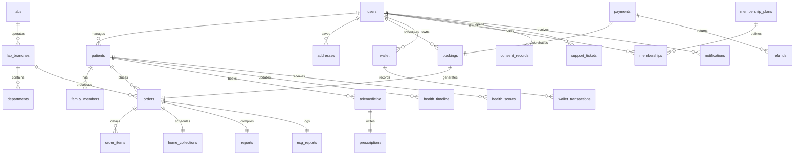
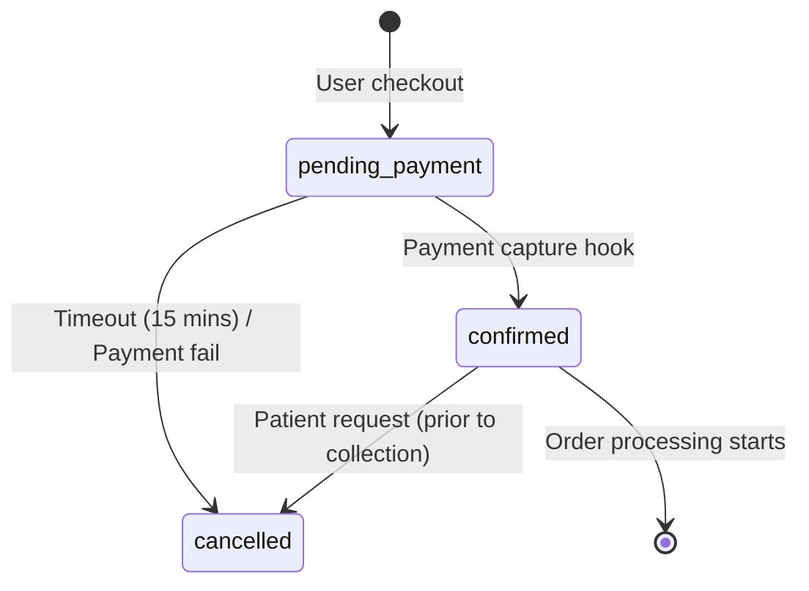
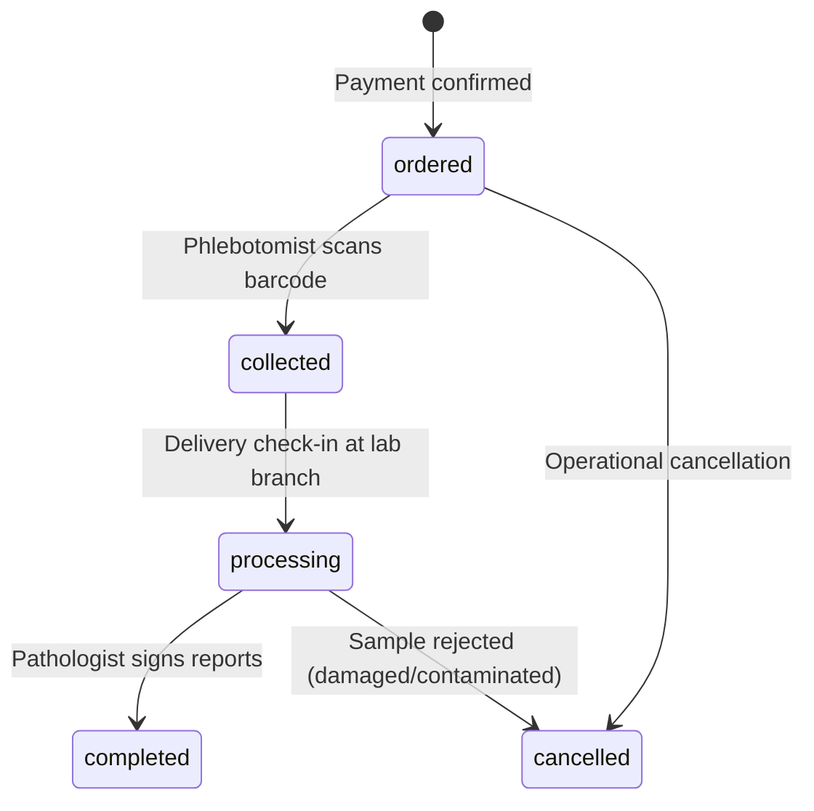
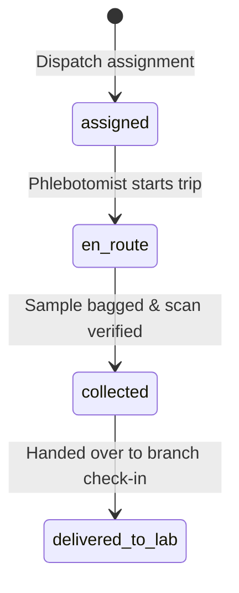
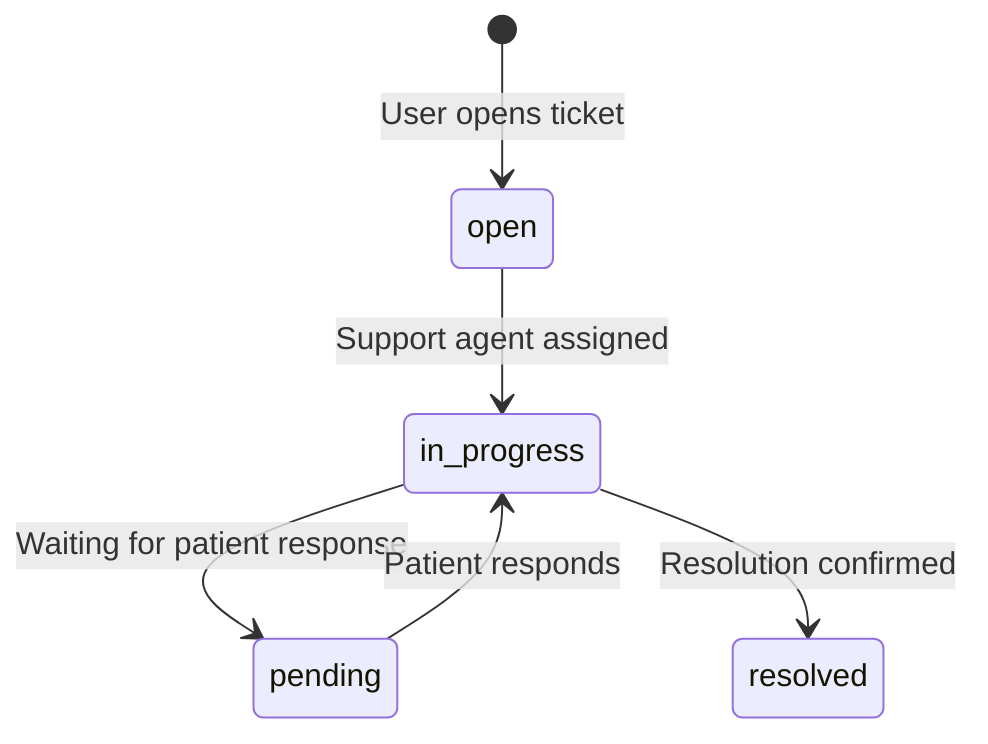

# Firestore Data Model Contract

This document serves as the official, frozen **Firestore Data Model Contract** for the **LabCircle** India-first preventive healthcare platform. It defines the schemas, structural patterns, relationship constraints, and transactional guidelines for all Firestore collections.

---

## 1. Database Design Principles

To ensure that LabCircle can scale to millions of users, maintain DPDP compliance, and pass NABL audits, the Firestore database adheres to a strict set of architectural principles.

### 1.1 Firestore Design Philosophy
Firestore is a NoSQL document database. We prioritize **read-optimized schemas**. Write amplification is acceptable if it yields single-document read paths ($O(1)$ read complexity) for client dashboards. 

### 1.2 Root vs. Subcollection Strategy
*   **Root Collections:** Used for primary entities (e.g., `users`, `patients`, `orders`, `reports`). Root collections support global queries, multi-field indexing, and allow security rules to evaluate access without crawling parent relationships.
*   **Subcollections:** Reserved strictly for bounded, child-dependent, and chronological data models (e.g., `/wallet/{uid}/transactions/{id}`). Subcollections must not grow indefinitely; if a relationship is unbounded (like logs or histories), it must be designed as a root collection with foreign keys.

### 1.3 Denormalization Rules
To avoid expensive database joins, critical reference fields are denormalized at write-time.
*   **Denormalized Fields:** Patient names, phone numbers, and test titles are copied directly onto the `/orders` and `/bookings` documents.
*   **Consistency Maintenance:** When a primary document is updated (e.g., a patient edits their phone number), a background Cloud Function triggers to update all corresponding denormalized references in active (non-completed) transactions. Completed transactions are locked to preserve historical invoice integrity.

### 1.4 Reference Strategy
All relationships are modeled using flat string identifiers (e.g., `patientId: "pat_123"`) rather than Firestore `DocumentReference` objects. This ensures clean serialization in Next.js Server Actions, simplifies client payload mapping, and guarantees ease of integration with external JSON APIs.

### 1.5 Naming and Typings Standards
*   **Collections:** Plural, snake_case (e.g., `test_categories`, `ecg_reports`).
*   **Fields:** camelCase (e.g., `createdAt`, `abhaAddress`).
*   **Timestamps:** Stored strictly using the native Firestore `Timestamp` type. Field names representing time must end with the suffix `At` (e.g., `collectedAt`, `signedAt`). No raw epoch integers or ISO strings are permitted.
*   **Identifiers:** All identifiers use UUIDv4 strings. User documents (`/users`, `/doctors`) use IDs that exactly match the Firebase Authentication UID.

### 1.6 Soft Delete Strategy
To comply with healthcare auditing regulations and DPDP consent tracking:
*   Physical deletion is prohibited on clinical, billing, and order collections.
*   A soft-delete pattern is enforced using two fields: `isDeleted: boolean` and `deletedAt: Timestamp | null`.
*   All queries must explicitly filter out documents where `isDeleted == true`.

### 1.7 Versioning Strategy
Every document contains a `schemaVersion: number` field (default: `1`). If a collection schema changes, the application code must handle both versions or execute an batch update script.

---

## 2. Complete Entity Catalog

The LabCircle platform is composed of 32 distinct collections organized into 7 logical domains:

```text
├── 1. Core Users & Profiles
│   ├── users
│   ├── patients
│   ├── family_members
│   └── addresses
├── 2. Diagnostics Catalog
│   ├── tests
│   ├── test_categories
│   └── packages
├── 3. Laboratory Hierarchy
│   ├── labs
│   ├── lab_branches
│   └── departments
├── 4. Booking & Logistics
│   ├── bookings
│   ├── orders
│   ├── order_items (Subcollection of orders)
│   └── home_collections
├── 5. Clinical Outcomes
│   ├── reports
│   └── ecg_reports
├── 6. Finance & Loyalty
│   ├── payments
│   ├── refunds
│   ├── wallet
│   ├── wallet_transactions (Subcollection of wallet)
│   ├── membership_plans
│   └── memberships
└── 7. CRM, History & Logs
    ├── notifications
    ├── telemedicine
    ├── prescriptions
    ├── corporates
    ├── coupons
    ├── support_tickets
    ├── health_timeline
    ├── health_scores
    ├── consent_records
    └── audit_logs
```

---

## 3. Collection Specifications

### 3.1 Core Users & Profiles

#### `users` (Root Collection)
*   **Purpose:** Central authentication lookup and authorization mapping.
*   **Primary Key:** Firebase Auth UID (`uid`).
*   **Required Fields:** `email: string`, `phone: string`, `role: string` (`patient` | `phlebotomist` | `lab_technician` | `pathologist` | `admin`), `schemaVersion: number`, `createdAt: Timestamp`, `updatedAt: Timestamp`.
*   **Optional Fields:** `displayName: string | null`.
*   **Relationships:** One-to-One with `patients`, One-to-Many with `consent_records`.
*   **Ownership & Security:** Owned by the authenticated user. Read/write allowed only for self (UID match) or system `admin`.
*   **Access Patterns:** Auth checks, user profile display.
*   **Delete Strategy:** Soft delete (`isDeleted: true`).

#### `patients` (Root Collection)
*   **Purpose:** Clinical demographic identity. Separated from `users` to support multi-profile configurations (e.g. family accounts managed under a single credentials login).
*   **Primary Key:** UUIDv4 string.
*   **Required Fields:** `primaryUserUid: string` (Ref to `users`), `fullName: string`, `dob: Timestamp`, `biologicalSex: string` (`male` | `female` | `other`), `createdAt: Timestamp`, `updatedAt: Timestamp`.
*   **Optional Fields:** `abhaId: string | null`, `abhaAddress: string | null`, `profilePhotoUrl: string | null`.
*   **Relationships:** Many-to-One with `users`, One-to-Many with `orders` and `family_members`.
*   **Ownership & Security:** Patient profile data read allowed for the primary user, clinical staff, and pathologists. Write allowed for primary user and system admins.
*   **Access Patterns:** Query by `primaryUserUid` to list profiles in patient settings; fetch by `id` during checkout.
*   **Delete Strategy:** Soft delete.

#### `family_members` (Root Collection)
*   **Purpose:** List dependents linked under a primary patient for group bookings.
*   **Primary Key:** UUIDv4 string.
*   **Required Fields:** `primaryPatientId: string` (Ref to `patients`), `fullName: string`, `relation: string` (`spouse` | `child` | `parent` | `sibling`), `dob: Timestamp`, `biologicalSex: string`, `createdAt: Timestamp`.
*   **Optional Fields:** `abhaId: string | null`.
*   **Relationships:** Many-to-One with `patients`.
*   **Ownership & Security:** Read/write allowed for the primary patient's user login.
*   **Access Patterns:** List dependents on patient checkout screens.
*   **Delete Strategy:** Hard delete allowed if no completed `orders` reference this member. Otherwise, soft delete.

#### `addresses` (Root Collection)
*   **Purpose:** Geolocations for home care visits and sample collection.
*   **Primary Key:** UUIDv4 string.
*   **Required Fields:** `userUid: string` (Ref to `users`), `label: string` (`Home` | `Work` | `Other`), `addressLine1: string`, `city: string`, `state: string`, `pincode: string`, `coordinates: GeoPoint`, `createdAt: Timestamp`.
*   **Optional Fields:** `addressLine2: string | null`, `landmark: string | null`.
*   **Relationships:** Many-to-One with `users`.
*   **Ownership & Security:** Read/write allowed only for owner (`userUid`).
*   **Access Patterns:** Query by `userUid` to display saved locations.
*   **Delete Strategy:** Hard delete allowed.

---

### 3.2 Diagnostics Catalog

#### `tests` (Root Collection)
*   **Purpose:** Clinical definitions of individual medical lab tests.
*   **Primary Key:** UUIDv4 string (e.g. `test_hba1c`).
*   **Required Fields:** `categoryId: string` (Ref to `test_categories`), `code: string` (LOINC), `name: string`, `price: number`, `prepInstructions: string`, `turnaroundTimeHours: number`, `normalRanges: map`, `isActive: boolean`.
*   **Optional Fields:** `description: string | null`.
*   **Relationships:** Many-to-One with `test_categories`, Many-to-Many with `packages`.
*   **Ownership & Security:** Read allowed public; write allowed only for system `admin` and authorized `lab_technician`.
*   **Access Patterns:** Query by search string, filter by `categoryId`.
*   **Delete Strategy:** Soft delete.

#### `test_categories` (Root Collection)
*   **Purpose:** Classification grouping for tests (e.g., Hemoglobin, Lipid Profile).
*   **Primary Key:** UUIDv4 string.
*   **Required Fields:** `name: string`, `description: string`, `iconName: string`.
*   **Optional Fields:** None.
*   **Relationships:** One-to-Many with `tests`.
*   **Ownership & Security:** Read allowed public; write allowed only for `admin`.
*   **Access Patterns:** List categories on landing pages.
*   **Delete Strategy:** Soft delete.

#### `packages` (Root Collection)
*   **Purpose:** Preventive screening health panels composed of multiple tests.
*   **Primary Key:** UUIDv4 string.
*   **Required Fields:** `name: string`, `testIds: array of strings` (Refs to `tests`), `price: number`, `prepInstructions: string`, `isActive: boolean`, `createdAt: Timestamp`.
*   **Optional Fields:** `description: string | null`, `imageUrl: string | null`.
*   **Relationships:** Many-to-Many with `tests`.
*   **Ownership & Security:** Read allowed public; write allowed only for `admin`.
*   **Access Patterns:** Query all active bundles on dashboard screens.
*   **Delete Strategy:** Soft delete.

---

### 3.3 Laboratory Hierarchy

#### `labs` (Root Collection)
*   **Purpose:** Parent corporate identity holding medical licenses.
*   **Primary Key:** UUIDv4 string.
*   **Required Fields:** `name: string`, `registrationNumber: string`, `hqAddress: string`, `createdAt: Timestamp`.
*   **Optional Fields:** None.
*   **Relationships:** One-to-Many with `lab_branches`.
*   **Ownership & Security:** Read public; write restricted to global `admin`.
*   **Access Patterns:** Single fetch by ID.
*   **Delete Strategy:** Soft delete.

#### `lab_branches` (Root Collection)
*   **Purpose:** Physical laboratory nodes handling sample intake and NABL licensing.
*   **Primary Key:** UUIDv4 string.
*   **Required Fields:** `labId: string` (Ref to `labs`), `name: string`, `address: string`, `pincode: string`, `coordinates: GeoPoint`, `isAccredited: boolean` (NABL status), `licenseNumber: string`, `createdAt: Timestamp`.
*   **Optional Fields:** `contactNumber: string | null`.
*   **Relationships:** Many-to-One with `labs`, One-to-Many with `departments` and `orders`.
*   **Ownership & Security:** Read allowed for patients (branch selectors) and staff. Write restricted to `admin`.
*   **Access Patterns:** Query by `pincode` or geolocation bounding box.
*   **Delete Strategy:** Soft delete.

#### `departments` (Root Collection)
*   **Purpose:** Section divisions inside a lab branch (e.g. Hematology, Pathology).
*   **Primary Key:** UUIDv4 string.
*   **Required Fields:** `branchId: string` (Ref to `lab_branches`), `name: string`, `code: string` (e.g., `HEM`, `BIO`), `createdAt: Timestamp`.
*   **Optional Fields:** `headStaffUid: string | null`.
*   **Relationships:** Many-to-One with `lab_branches`.
*   **Ownership & Security:** Read/write allowed for `admin` and lab staff with matching branch claims.
*   **Access Patterns:** Query departments for routing diagnostic steps.
*   **Delete Strategy:** Hard delete allowed if empty.

---

### 3.4 Booking & Logistics

#### `bookings` (Root Collection)
*   **Purpose:** Holds reservation carts and collection schedules.
*   **Primary Key:** UUIDv4 string.
*   **Required Fields:** `userUid: string` (Ref to `users`), `patientId: string` (Ref to `patients`), `items: array of maps` `{ type: 'test'|'package', id: string, name: string, price: number }`, `slotDate: string` (`YYYY-MM-DD`), `slotTime: string`, `addressId: string` (Ref to `addresses`), `status: string` (`pending_payment` | `confirmed` | `cancelled`), `pricing: map` `{ subtotal, discount, total }`, `createdAt: Timestamp`.
*   **Optional Fields:** `couponCode: string | null`.
*   **Relationships:** Many-to-One with `users` and `patients`, One-to-One with `orders`.
*   **Ownership & Security:** Read/write allowed for owner (`userUid`) and admin.
*   **Access Patterns:** Fetch user active bookings.
*   **Delete Strategy:** Soft delete.

#### `orders` (Root Collection)
*   **Purpose:** Confirmed orders driving active laboratory diagnostics and processing queues.
*   **Primary Key:** UUIDv4 string.
*   **Required Fields:** `bookingId: string` (Ref to `bookings`), `patientId: string` (Ref to `patients`), `labId: string` (Ref to `labs`), `branchId: string` (Ref to `lab_branches`), `status: string` (`ordered` | `collected` | `processing` | `completed` | `cancelled`), `paymentId: string` (Ref to `payments`), `createdAt: Timestamp`, `updatedAt: Timestamp`.
*   **Optional Fields:** None.
*   **Relationships:** One-to-One with `bookings`, Many-to-One with `patients`, One-to-Many with `order_items` and `home_collections`.
*   **Ownership & Security:** Read allowed for patient (owner), assigned phlebotomist, and lab technicians. Write restricted to clinical staff and system executors.
*   **Access Patterns:** Query active orders by `branchId`, view patient history.
*   **Delete Strategy:** Soft delete.

#### `order_items` (Subcollection of `/orders/{id}/items`)
*   **Purpose:** Line items details for tracking status on individual tests.
*   **Primary Key:** UUIDv4 string.
*   **Required Fields:** `testId: string` (Ref to `tests`), `name: string`, `status: string` (`pending` | `collected` | `in-lab` | `completed`), `price: number`.
*   **Optional Fields:** `notes: string | null`.
*   **Relationships:** Bounded subcollection of `orders`.
*   **Ownership & Security:** Inherits parent `orders` permissions.
*   **Access Patterns:** Subcollection query during diagnostic data entry.
*   **Delete Strategy:** Hard delete allowed if parent status is `ordered`.

#### `home_collections` (Root Collection)
*   **Purpose:** Logistics scheduling and sample transport handoffs.
*   **Primary Key:** UUIDv4 string.
*   **Required Fields:** `orderId: string` (Ref to `orders`), `executiveId: string` (Ref to `collection_executives`), `status: string` (`assigned` | `en-route` | `collected` | `delivered_to_lab`), `createdAt: Timestamp`.
*   **Optional Fields:** `sampleBarcode: string | null`, `collectedAt: Timestamp | null`, `deliveredAt: Timestamp | null`, `notes: string | null`.
*   **Relationships:** Many-to-One with `orders`, Many-to-One with `collection_executives`.
*   **Ownership & Security:** Read allowed for patient, assigned phlebotomist, and lab administrators. Write allowed for assigned phlebotomist and system admin.
*   **Access Patterns:** Query by `executiveId` to load active routes.
*   **Delete Strategy:** Soft delete.

#### `collection_executives` (Root Collection)
*   **Purpose:** Profile and zone configurations for phlebotomists.
*   **Primary Key:** Firebase Auth UID (`uid`).
*   **Required Fields:** `fullName: string`, `phone: string`, `vehicleNumber: string`, `pincodesCovered: array of strings`, `isAvailable: boolean`, `updatedAt: Timestamp`.
*   **Optional Fields:** `lastCoordinates: GeoPoint | null`.
*   **Relationships:** One-to-Many with `home_collections`.
*   **Ownership & Security:** Read allowed for administrators and patients assigned to this collector. Write restricted to `admin` and self.
*   **Access Patterns:** Query by pincode search.
*   **Delete Strategy:** Soft delete.

---

### 3.5 Clinical Outcomes

#### `reports` (Root Collection)
*   **Purpose:** Clinical diagnostics reports containing test results.
*   **Primary Key:** UUIDv4 string.
*   **Required Fields:** `orderId: string` (Ref to `orders`), `patientId: string` (Ref to `patients`), `labId: string` (Ref to `labs`), `branchId: string` (Ref to `lab_branches`), `results: map` `{ testCode: { value: number, status: 'normal'|'abnormal'|'critical', range: string } }`, `isSigned: boolean`, `schemaVersion: number`, `createdAt: Timestamp`.
*   **Optional Fields:** `pdfUrl: string | null` (GCS signed URL path), `pathologistUid: string | null` (Ref to `users`), `approvedAt: Timestamp | null`.
*   **Relationships:** One-to-One with `orders`, Many-to-One with `patients`.
*   **Ownership & Security:** Read allowed for patient, pathologists, and lab branch staff. Write restricted to pathologists and admins.
*   **Access Patterns:** Fetch report history by `patientId`, query pending sign-offs by `pathologistUid`.
*   **Delete Strategy:** Soft delete only.

#### `ecg_reports` (Root Collection)
*   **Purpose:** Diagnostic details for home-collected ECG waves.
*   **Primary Key:** UUIDv4 string.
*   **Required Fields:** `orderId: string` (Ref to `orders`), `patientId: string` (Ref to `patients`), `telemetryUrl: string` (GCS waveform file reference), `status: string` (`pending_review` | `reviewed`), `createdAt: Timestamp`.
*   **Optional Fields:** `reviewedBy: string | null` (Ref to `doctors`), `interpretation: string | null`, `reviewedAt: Timestamp | null`.
*   **Relationships:** One-to-One with `orders`, Many-to-One with `patients`.
*   **Ownership & Security:** Read allowed for patient and doctors. Write allowed only for doctors and admins.
*   **Access Patterns:** List pending reviews for medical practitioners.
*   **Delete Strategy:** Soft delete only.

---

### 3.6 Finance & Loyalty

#### `payments` (Root Collection)
*   **Purpose:** Financial transactions records mapped to Razorpay checkpoints.
*   **Primary Key:** Razorpay Payment ID string.
*   **Required Fields:** `bookingId: string` (Ref to `bookings`), `userUid: string` (Ref to `users`), `amount: number` (in paise, integer), `currency: string` (`INR`), `status: string` (`captured` | `failed` | `refunded`), `createdAt: Timestamp`.
*   **Optional Fields:** `failureReason: string | null`.
*   **Relationships:** One-to-One with `bookings`.
*   **Ownership & Security:** Read allowed only for owner (`userUid`) and admin. Write restricted to system backend webhooks.
*   **Access Patterns:** Billing history query by `userUid`.
*   **Delete Strategy:** Lock strictly (no delete allowed).

#### `refunds` (Root Collection)
*   **Purpose:** Tracks refunds for booking cancellations or failures.
*   **Primary Key:** Razorpay Refund ID string.
*   **Required Fields:** `paymentId: string` (Ref to `payments`), `amount: number`, `status: string` (`pending` | `processed`), `createdAt: Timestamp`.
*   **Optional Fields:** `reason: string | null`.
*   **Relationships:** Many-to-One with `payments`.
*   **Ownership & Security:** Read allowed for owner and admin. Write restricted to system backend execution.
*   **Access Patterns:** Audit trail updates.
*   **Delete Strategy:** Lock strictly.

#### `wallet` (Root Collection)
*   **Purpose:** User credits ledger.
*   **Primary Key:** User UID (`uid`).
*   **Required Fields:** `balance: number` (in paise), `updatedAt: Timestamp`.
*   **Optional Fields:** None.
*   **Relationships:** One-to-One with `users`.
*   **Ownership & Security:** Read allowed for owner and admin. Write restricted to system backend transactions.
*   **Access Patterns:** Fetch wallet balance.
*   **Delete Strategy:** Soft delete.

#### `wallet_transactions` (Subcollection of `/wallet/{uid}/transactions`)
*   **Purpose:** Ledger transaction history.
*   **Primary Key:** UUIDv4 string.
*   **Required Fields:** `amount: number` (positive/negative), `type: string` (`refund` | `purchase` | `cashback`), `description: string`, `timestamp: Timestamp`.
*   **Optional Fields:** `referenceId: string | null`.
*   **Relationships:** Bounded subcollection of `wallet`.
*   **Ownership & Security:** Inherits parent `wallet` permissions.
*   **Access Patterns:** Chronological ledger list query.
*   **Delete Strategy:** Lock strictly.

#### `membership_plans` (Root Collection)
*   **Purpose:** Wellness subscription details catalog.
*   **Primary Key:** UUIDv4 string.
*   **Required Fields:** `name: string`, `price: number`, `durationMonths: number`, `benefits: map` `{ discountPercentage: number, freeDoctorConsults: number }`, `isActive: boolean`.
*   **Optional Fields:** None.
*   **Relationships:** One-to-Many with `memberships`.
*   **Ownership & Security:** Read public; write restricted to `admin`.
*   **Access Patterns:** List pricing cards.
*   **Delete Strategy:** Soft delete.

#### `memberships` (Root Collection)
*   **Purpose:** Tracks active memberships of patients.
*   **Primary Key:** UUIDv4 string.
*   **Required Fields:** `userUid: string` (Ref to `users`), `planId: string` (Ref to `membership_plans`), `startDate: Timestamp`, `endDate: Timestamp`, `status: string` (`active` | `expired`), `createdAt: Timestamp`.
*   **Optional Fields:** None.
*   **Relationships:** Many-to-One with `users`.
*   **Ownership & Security:** Read allowed for owner and admin. Write restricted to backend systems.
*   **Access Patterns:** Authenticated entitlement checks.
*   **Delete Strategy:** Soft delete.

---

### 3.7 CRM & History

#### `notifications` (Root Collection)
*   **Purpose:** User alert inbox.
*   **Primary Key:** UUIDv4 string.
*   **Required Fields:** `userUid: string` (Ref to `users`), `title: string`, `body: string`, `isRead: boolean`, `sentAt: Timestamp`.
*   **Optional Fields:** `deepLinkUrl: string | null`.
*   **Relationships:** Many-to-One with `users`.
*   **Ownership & Security:** Read/write (specifically updates to `isRead`) allowed for owner (`userUid`). Write allowed for system backend.
*   **Access Patterns:** Query unread notifications list.
*   **Delete Strategy:** Hard delete allowed after 30 days.

#### `telemedicine` (Root Collection)
*   **Purpose:** Video appointments logs.
*   **Primary Key:** UUIDv4 string.
*   **Required Fields:** `patientId: string` (Ref to `patients`), `doctorId: string` (Ref to `doctors`), `appointmentTime: Timestamp`, `status: string` (`scheduled` | `ongoing` | `completed` | `cancelled`), `meetingLink: string`, `createdAt: Timestamp`.
*   **Optional Fields:** `clinicalNotes: string | null`.
*   **Relationships:** Many-to-One with `patients` and `doctors`, One-to-One with `prescriptions`.
*   **Ownership & Security:** Read allowed for patient and doctor. Write restricted to doctors and admins.
*   **Access Patterns:** List upcoming appointments.
*   **Delete Strategy:** Soft delete.

#### `prescriptions` (Root Collection)
*   **Purpose:** Digitally signed clinical prescriptions.
*   **Primary Key:** UUIDv4 string.
*   **Required Fields:** `telemedicineId: string` (Ref to `telemedicine`), `patientId: string` (Ref to `patients`), `doctorId: string` (Ref to `doctors`), `medications: array of maps` `{ name: string, dosage: string, frequency: string, durationDays: number }`, `createdAt: Timestamp`.
*   **Optional Fields:** `pdfUrl: string | null`.
*   **Relationships:** One-to-One with `telemedicine`.
*   **Ownership & Security:** Read allowed for patient and doctors. Write restricted to doctors.
*   **Access Patterns:** Download script.
*   **Delete Strategy:** Soft delete only.

#### `corporates` (Root Collection)
*   **Purpose:** Company domains configurations for bulk employee screenings.
*   **Primary Key:** UUIDv4 string.
*   **Required Fields:** `name: string`, `domainPattern: string` (e.g. `@corporation.com`), `planDetails: map` `{ testDiscount: number }`, `isActive: boolean`, `createdAt: Timestamp`.
*   **Optional Fields:** None.
*   **Relationships:** One-to-Many with `users` (linked via verification).
*   **Ownership & Security:** Read public; write restricted to `admin`.
*   **Access Patterns:** Verify registration emails.
*   **Delete Strategy:** Soft delete.

#### `coupons` (Root Collection)
*   **Purpose:** Discount codes.
*   **Primary Key:** Uppercase code string (e.g. `HEALTH10`).
*   **Required Fields:** `discountPercentage: number`, `maxDiscountAmount: number`, `minOrderAmount: number`, `validUntil: Timestamp`, `isActive: boolean`.
*   **Optional Fields:** None.
*   **Relationships:** None.
*   **Ownership & Security:** Read public; write restricted to `admin`.
*   **Access Patterns:** Validate code during checkout.
*   **Delete Strategy:** Soft delete.

#### `support_tickets` (Root Collection)
*   **Purpose:** Customer support logs.
*   **Primary Key:** UUIDv4 string.
*   **Required Fields:** `userUid: string` (Ref to `users`), `subject: string`, `description: string`, `status: string` (`open` | `in_progress` | `resolved`), `createdAt: Timestamp`, `updatedAt: Timestamp`.
*   **Optional Fields:** `assignedStaffUid: string | null`.
*   **Relationships:** Many-to-One with `users`.
*   **Ownership & Security:** Read/write (open/cancel) allowed for owner. Read/write (status changes/assigns) allowed for admin/support staff.
*   **Access Patterns:** Manage queue logs.
*   **Delete Strategy:** Soft delete.

#### `health_timeline` (Root Collection)
*   **Purpose:** Unified patient historical timeline.
*   **Primary Key:** UUIDv4 string.
*   **Required Fields:** `patientId: string` (Ref to `patients`), `date: Timestamp`, `type: string` (`test_result` | `vital_log` | `consultation`), `summary: string`, `referenceId: string` (Ref to target doc), `createdAt: Timestamp`.
*   **Optional Fields:** None.
*   **Relationships:** Many-to-One with `patients`.
*   **Ownership & Security:** Read allowed for patient and doctors. Write restricted to backend processes.
*   **Access Patterns:** Render interactive timeline.
*   **Delete Strategy:** Soft delete.

#### `health_scores` (Root Collection)
*   **Purpose:** Metric tracking calculations.
*   **Primary Key:** UUIDv4 string.
*   **Required Fields:** `patientId: string` (Ref to `patients`), `score: number`, `breakdown: map` `{ cardiac: number, metabolic: number, cellular: number }`, `calculatedAt: Timestamp`.
*   **Optional Fields:** None.
*   **Relationships:** Many-to-One with `patients`.
*   **Ownership & Security:** Read allowed for patient and doctors. Write restricted to system scoring engines.
*   **Access Patterns:** Fetch last calculated score.
*   **Delete Strategy:** Soft delete.

#### `consent_records` (Root Collection)
*   **Purpose:** DPDP Act consent ledger.
*   **Primary Key:** UUIDv4 string.
*   **Required Fields:** `userUid: string` (Ref to `users`), `purpose: string` (e.g. `diagnostics`), `consentGranted: boolean`, `grantedAt: Timestamp`, `schemaVersion: number`.
*   **Optional Fields:** `revokedAt: Timestamp | null`.
*   **Relationships:** Many-to-One with `users`.
*   **Ownership & Security:** Read allowed for owner and admin. Write allowed for owner (grants/revokes) and system.
*   **Access Patterns:** Verify consent before processing results.
*   **Delete Strategy:** Lock strictly (no delete allowed).

#### `audit_logs` (Root Collection)
*   **Purpose:** NABL & DPDP compliance auditing logs.
*   **Primary Key:** UUIDv4 string.
*   **Required Fields:** `actorUid: string`, `action: string` (`READ` | `WRITE` | `EXPORT` | `DELETE`), `documentId: string`, `collection: string`, `timestamp: Timestamp`, `rationale: string`, `metadata: map` `{ session: string, device: { os: string, browser: string, model: string }, ip: string, appVersion: string, platform: string }`.
*   **Optional Fields:** None.
*   **Relationships:** None.
*   **Ownership & Security:** Write-only from authenticated cloud scripts. Read, update, and delete are strictly disabled for all client UIs.
*   **Access Patterns:** Global security auditing scans.
*   **Delete Strategy:** Lock strictly (no delete allowed).

---

## 4. Relationship Diagram

The following diagram maps the entity relations, document links, and foreign keys across all modules:



---

## 5. Query Design

Firestore queries require index patterns to handle filtering and sorting at scale.

### 5.1 Patient Orders History
*   **Query:** Fetch orders for a specific patient sorted by date.
*   **Filters:** `patientId == PATIENT_ID`, `isDeleted == false`.
*   **Sorting:** `createdAt` (Descending).
*   **Pagination:** Cursor-based (`limit(10).startAfter(lastVisibleDoc)`).
*   **Expected Index:** `orders` collection: `patientId` (Ascending) + `createdAt` (Descending).

### 5.2 Phlebotomist Active Route
*   **Query:** List all active assigned home collection tasks for a phlebotomist.
*   **Filters:** `executiveId == EXECUTIVE_ID`, `status in ['assigned', 'en-route', 'collected']`.
*   **Sorting:** `createdAt` (Ascending).
*   **Pagination:** None (small dataset, loaded complete).
*   **Expected Index:** `home_collections` collection: `executiveId` (Ascending) + `status` (Ascending) + `createdAt` (Ascending).

### 5.3 Pathologist Pending Queue
*   **Query:** Load unapproved diagnostic reports for a lab branch.
*   **Filters:** `branchId == BRANCH_ID`, `isSigned == false`.
*   **Sorting:** `createdAt` (Ascending).
*   **Pagination:** Cursor-based (`limit(20)`).
*   **Expected Index:** `reports` collection: `branchId` (Ascending) + `isSigned` (Ascending) + `createdAt` (Ascending).

### 5.4 Unified Health Timeline
*   **Query:** Load a patient's chronological timeline.
*   **Filters:** `patientId == PATIENT_ID`, `isDeleted == false`.
*   **Sorting:** `date` (Descending).
*   **Pagination:** Cursor-based (`limit(15)`).
*   **Expected Index:** `health_timeline` collection: `patientId` (Ascending) + `date` (Descending).

---

## 6. Transaction Design

To guarantee clinical and financial data consistency, operations changing multiple documents must execute via Firestore Transactions (atomic read-then-write operations).

### 6.1 Transaction: Create Order & Booking
1.  **Read:** Check slot vacancy in `/labs/{labId}/slots/{slotId}`. Verify that current booking numbers are below the capacity threshold.
2.  **Read:** Validate that coupon (if used) is active in `/coupons/{code}` and user limit is not exceeded.
3.  **Write:** Write the pending document in `/bookings/{id}`.
4.  **Write:** Lock the slot seat by incrementing `activeBookings` on the slot catalog.

### 6.2 Transaction: Payment Success (Razorpay Webhook)
1.  **Read:** Read and verify booking data from `/bookings/{bookingId}`. Check that payment is not already captured.
2.  **Write:** Write payment details to `/payments/{paymentId}`.
3.  **Write:** Update booking status to `confirmed`.
4.  **Write:** Write a new active tracking record to `/orders/{id}`.
5.  **Write:** Write a route task to `/home_collections/{id}`.

### 6.3 Transaction: Assign Phlebotomist (Concurrency Safe)
1.  **Read:** Fetch `/home_collections/{id}`. Verify that status is `assigned` or `pending` (ensure no double-assignment).
2.  **Read:** Fetch `/collection_executives/{executiveId}` to verify availability status.
3.  **Write:** Update collection assignment fields on `/home_collections/{id}`.
4.  **Write:** Set availability properties on the executive profile.

### 6.4 Transaction: Generate Report & Finalize
1.  **Read:** Load result entries in `/reports/{id}`. Verify pathologist credentials against registration profiles.
2.  **Write:** Lock results by setting `isSigned: true`, `pathologistUid: PATHOLOGIST_UID`, and `approvedAt: TIMESTAMP`.
3.  **Write:** Write a summary record to `/health_timeline/{id}`.
4.  **Write:** Write a notification trigger to `/notifications/{id}`.

### 6.5 Transaction: Wallet Refund Operations
1.  **Read:** Verify order payment status. Read user's current `/wallet/{uid}` balance.
2.  **Write:** Write a transaction record containing signed refund amounts to `/wallet/{uid}/transactions/{id}`.
3.  **Write:** Atomically increment `/wallet/{uid}` balance by the refund amount.

---

## 7. Status Lifecycles

Business process workflows are governed by state machines. Status transitions must validate against allowed states:

### 7.1 Booking Lifecycle


### 7.2 Order Lifecycle


### 7.3 Home Collection Lifecycle


### 7.4 Support Ticket Lifecycle


---

## 8. Performance Strategy

Firestore scales automatically, but schema layout dictates lookup speeds and database billing:

*   **Read Optimization:** We utilize denormalization for list-view dashboards. For example, rather than loading 20 `/patients` records when querying a laboratory branch's active order list, the patient's name is saved directly on the order document, reducing reads from 40 to 20 documents.
*   **Write Optimization:** Avoid sequential hot-spots by sharding high-throughput counters. If we need to count total tests processed in real-time, write to distributed sharded counter documents rather than incrementing a single global catalog document.
*   **Document Size Enforcements:** Unbounded array fields (like patient tracking updates or messages logs) must never be saved inside a parent document. They must be isolated into subcollections or distinct collections. Every document must stay well below the 1MB Firestore size limit.
*   **Hot Document Avoidance:** Do not design sequences that write to the same document multiple times per second (e.g. phlebotomist real-time location logs must be sent via temporary WebSockets or lightweight caches, rather than writing to Firestore on every GPS ping).

---

## 9. Future Expansion

The data model contract is built to integrate upcoming preventive health modules:

*   **AI Report Interpretation:** The `/reports` collection results are structured as typed map structures (`{ testCode: { value, status } }`). An AI inference engine can read this map and write automated summaries to `/reports/{id}/ai_interpretation` without altering the primary clinical report PDF.
*   **Longevity Dashboard:** The flat `/health_scores` and `/health_timeline` collections allow analytics engines to query historical data and plot biomarker trends.
*   **Remote Patient Monitoring (RPM) & Wearables:** High-frequency IoT metrics (e.g., continuous glucose monitoring datasets) will bypass Firestore storage and write directly to Google Cloud Storage as raw files (e.g., `/telemetry/{patientId}/cgm_{date}.csv`). A single summary document containing aggregate metrics will then be written to `/health_timeline` to notify doctors of anomalies.
*   **Multi-Laboratory & Multi-City Expansion:** The `/lab_branches` and `/labs` collections support location coordinates and localized pincodes, enabling geographical querying as LabCircle scales from one city to nationwide operations.

---

## 10. Review Checklist

Before starting implementation, verify that the schemas comply with the following standards:

- [x] **Scalable:** All queries scale based on the result set size, not the collection size. No unbounded array structures exist.
- [x] **Secure:** Document layouts support path-based security rules using custom token roles.
- [x] **DPDP Ready:** Enforces explicit consent mapping via `consent_records` and logs all access in the read-only `audit_logs`.
- [x] **ABDM Ready:** Structures patient identifiers to map to Ayushman Bharat digital registries (ABHA ID, ABHA Address).
- [x] **NABL Ready:** Holds NABL-required diagnostic report details, including reference ranges, branch metadata, and signature properties.
- [x] **Firestore Best Practices:** Enforces Firestore native `Timestamp` schemas, uses flat string keys for references, and utilizes soft deletes.
- [x] **Production Ready:** Pre-defines indexing parameters, backup schemas, and emulator ports.
