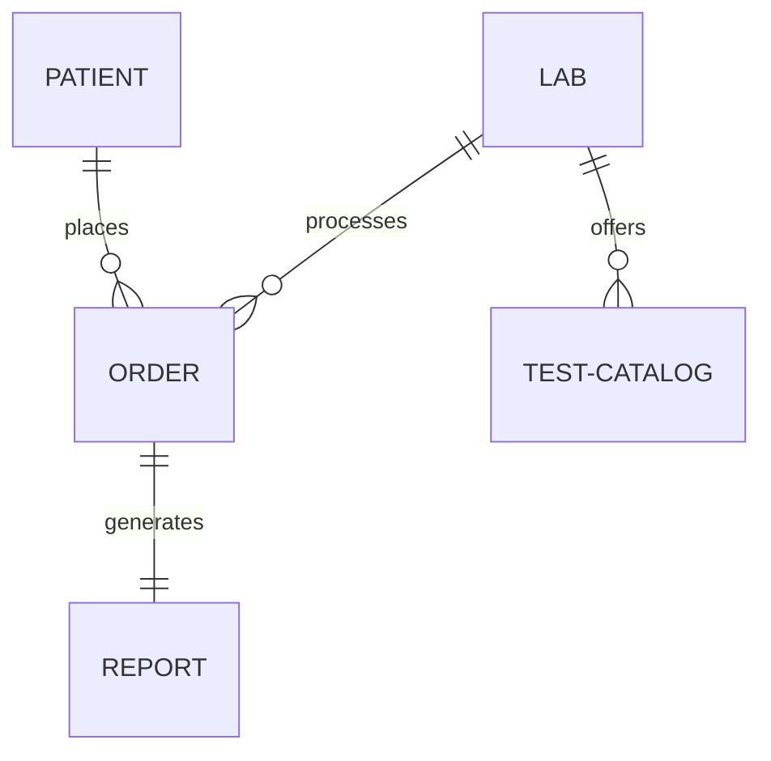

# Database Design Specification: LabCircle

## 1. Architectural Strategy
LabCircle uses a hybrid model. The primary storage uses **NoSQL (Cloud Firestore)** for high-throughput, real-time client sync and scalability, complemented by a relational schema (optional, e.g. PostgreSQL) for analytical dashboards if needed.

## 2. Entity Relationship Overview
The system models data around these principal aggregates:
- **User / Profile:** Identifies account credentials, roles, and contacts.
- **Patient Profile:** Tracks medical demographic details, vital signs history, and references.
- **Laboratory Workspace:** Details diagnostic business accounts, staff, and pricing catalogs.
- **Diagnostic Order:** Tracks transactional requests (ordered date, status, payment details).
- **Lab Report:** Houses specific test values, biological ranges, and PDF attachment links.

## 3. High-Level Data Model

## 4. Key Collections & Data Types
- **Patients:** `UUID` (PK), Name, DOB, Biological Sex, Mobile (Unique), Address.
- **Orders:** `UUID` (PK), PatientID (FK), LabID (FK), Status (Enum), OrderDate, Items (Array of TestIDs).
- **Reports:** `UUID` (PK), OrderID (FK), PatientID (FK), LabID (FK), Status (Enum), SignedBy, Values (Nested Map), PdfUrl.
- **Tests:** `UUID` (PK), Code (LOINC), Name, Unit, DefaultRanges (JSON).
