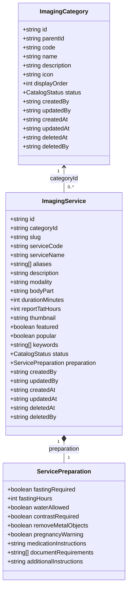

# Diagnostic Imaging Catalog Architecture Specification

This document serves as the system architecture blueprint and operations guide for the **Diagnostic Imaging Catalog** (Phase 1). It provides a baseline reference for future modules to build booking, scheduling, and results logging on top of this schema.

---

## 1. Firestore Collections

The module is powered by two primary database catalog collections:
- **`imaging_categories`**: Hierarchical classification trees mapping scan disciplines.
- **`imaging_services`**: Preset inventory of 500+ diagnostic scanning catalog items.

---

## 2. Entity Relationships & Category Hierarchy

### Category Tree
Categories support recursive grouping hierarchies via `parentId`.
- **Top-Level Parent Category**: point `parentId` to `null` (e.g. `Diagnostic Imaging`, `Laboratory`).
- **Child Category**: point `parentId` to their parent's document ID (e.g. `MRI` or `CT Scan` under `Diagnostic Imaging`).
This schema allows multi-tier classification directories without requiring any schema migrations or code changes.

---

## 3. Service Metadata & Structured Preparation

### Service Metadata
Services capture descriptive details for mapping scanning operations:
- `slug`: Human-readable clean routing path (e.g. `"hrct-chest"`).
- `modality` & `bodyPart`: Machine routing keys (e.g. `"CT Scan"`, `"Chest"`).
- `durationMinutes` & `reportTatHours`: Quantifiable operational targets (e.g. `30` minutes duration, `24` hours turnaround) rather than localized text strings, keeping search indexing and display clean.

### Structured Patient Preparation (`ServicePreparation`)
Preparation is encapsulated as a nested JSON map in Firestore:
- **Fasting Protocols**: `fastingRequired`, `fastingHours`, `waterAllowed`.
- **Safety Indicators**: `removeMetalObjects`, `pregnancyWarning`.
- **Contrast Scans**: `contrastRequired`.
- **Instructional guides**: `medicationInstructions`, `documentRequirements` (mandatory papers checklist), and `additionalInstructions`.

---

## 4. Search Strategy
Service listings leverage a multi-factor search filter in the service layer (`ImagingCatalogService.ts`):
1. **Text Matching**: Sub-string checks performed on `serviceName`, `serviceCode`, `modality`, `bodyPart`, `aliases`, and `keywords` tags.
2. **Category Isolation**: Filters list by category selection matches (pre-filterable via URL parameters).
3. **Structured Badges Filtering**: Isolates services requiring fasting or contrast diagnostics.
4. **Admin Toggles**: Restricts active list retrieval based on status or soft-delete criteria.

---

## 5. Audit & Lifecycle Fields

### Audit Trails
Every document in `imaging_categories` and `imaging_services` tracks the following audit attributes:
- `createdBy`: UID of the staff user who registered the item.
- `updatedBy`: UID of the staff user who performed the last revision.
- `createdAt` & `updatedAt`: ISO-8601 strings mapping timestamps.

### Soft Delete Support
To prevent database data-loss and maintain order history integrity, documents are soft deleted instead of purged:
- `deletedAt`: ISO-8601 timestamp string populated on delete actions.
- `deletedBy`: UID of the administrative staff member who archived the item.
Queries automatically exclude documents having `deletedAt != null` unless `includeDeleted: true` is explicitly passed by an administrator.

### Catalog Status Lifecycle (`CatalogStatus`)
- **`Draft`**: Catalog item under preparation. Visible only to logged-in administrators and staff users.
- **`Published`**: Active catalog item. Visible everywhere (patients, technicians, and catalog indices).
- **`Archived`**: Retired catalog item. Hidden from patients. Immutable and locked (cannot be assigned to new diagnostic center offerings in future milestones).

---

## 6. Code Immutability Rules
Once a record is created, certain key identity elements cannot be altered to prevent relational integrity issues across systems:
- **Category**: `code` field is immutable.
- **Service**: `serviceCode` field is immutable.
The service layer validation guards reject any updates modifying these fields and throw strict validation errors.

---

## 7. Future Extension Points

The catalog layout is designed to serve as the structural anchor for all subsequent diagnostic phases:
- **Phase 2 (Diagnostic Centres)**: Will create `diagnostic_centres` (e.g. address, phone, geolocation, status, equipment).
- **Phase 3 (Centre Services)**: Will map catalog items to centres in a join table `centre_services` (e.g. `serviceId`, `centreId`, `priceCharged`, `activeSlotRules`). This decouples pricing and local availability from the catalog.
- **Phase 4 (Appointments)**: Will link appointment bookings to dynamic scheduling grids and time slots.
- **Phase 5 (Bookings)**: Will create checkouts for imaging service bookings.
- **Phase 6 (Reports)**: Will attach imaging files (DICOM) and radiology findings to bookings.
